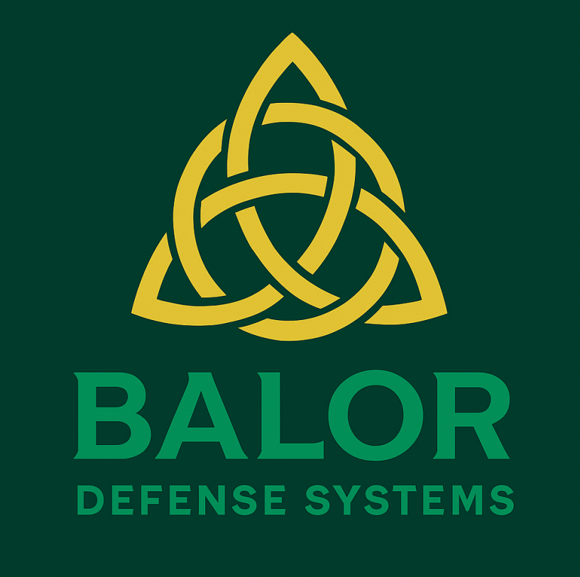

<!-- _class: title -->

# DIU Dual-Use University Accelerator Challenge
## Balor Defense Systems

**Revolutionizing Defense Technology Through Dual-Use Innovation**

---

<!-- _class: title -->

<!-- This slide is intentionally left blank for pacing or transitions. -->

---

## Who We Are

We are a **pre-revenue company** hoping to break into the defense field with multiple projects cultivated by **Purdue University students**

**Cian:** Computer Engineering: Founder of the Purdue National Defense Society, DCTC cohort 1, founder of Balor

**Aditya:** Aerospace Engineering: Lead Engineer of the NDS CUAS team, Cofounder of Balor, Systems Engineer intern at Leonardo DRS (CUAS and Tank APS), hypersonic research for Stratolaunch

**Michael:** Computer Engineer: Automation intern at Nucor, CV expert, Targeting lead for NDS CUAS

**Zach:** Computer Science: Lead of Cybersecurity team, Sandia Boy Wonder, Software Engineer intern at Northrop, Security Researcher

---

## Who We Are

**Company Description:** CIAN WRITES. Unfortunately, they recommend talking about how new the company is, what you can produce now (very little), and what you plan to produce (a lot)

**Michael Lamiman**
Honors Computer Engineering
Automation intern at Nucor, CV expert, Targeting lead for NDS CUAS

**Zachary Kirkeby**
Computer Science
Software Engineer Intern at Northrop Grumman, Security and RF expert, Cybersecurity Lead for NDS

---

## DOD Mission Needs

Deepen our Understanding and Awareness of Unmanned Systems Trends and Threat

How can we gain a greater understanding of unmanned systems and their deployment, threats, and use cases?

Defend Against Unmanned Systems Threats to U.S. Interests

How can we improve our active and passive defenses by clarifying, streamlining, and delegating responses?

We focus on tackling these specific DOD Mission Needs

**Note:** Sourced from DOD Strategy Fact Sheet on Countering Unmanned Systems

---

## Executive Summary

A two part system combining a full band Radio Frequency Scanner and a Turret Mounted CV system, integrated with an Edge AI and networked with short range communications

This system is man portable, and can be deployed by individual personnel on the battlefield or in the civilian world, and immediately begin collecting data on the UAS systems in the area

**The Process:**
- Radio Frequency Scanners perform initial detection, and determines target direction, heading, and collects communication data
- Computer Vision System then points at, and collects in-depth visual data on the target
- Edge AI uses the collected data to recommend individual system response, and communicate with other units to create a cohesive, live view of the operating space

---

## Computer Vision - Core Functionality in CUAS

CV's Role in Integrated Drone Defense

Computer Vision serves as the intelligent core of the proposed Counter-UAS (CUAS) system, transforming raw sensor data into actionable intelligence for threat assessment and response.

**Input:** Live video feed from a turret-mounted camera, directed by RF scanner data (target direction, velocity, direction of travel).

**Objective:** Rapid, accurate, and autonomous identification, tracking, and characterization of airborne targets to enable effective defensive measures.

**Integration:** Seamlessly integrates with RF detection for initial cueing and subsequent weapon system recommendations.

**Output:** Real-time data streams including target classification, threat assessment, tracking parameters, and recommended interdiction strategies.

---

## Computer Vision - Target Identification & Tracking

Precision Detection and Classification

The CV model performs multi-class classification and robust tracking to differentiate legitimate airborne objects from potential threats, ensuring minimal false positives.

**Primary Identification:**
- **UAV:** Classifies various system types (quadcopters, fixed-wing, custom builds)
- **Non-UAV:** Identifies common benign airborne objects (birds, civilian aircraft, balloons, debris)

**Tracking Capabilities:**
- **Persistent Tracking:** Maintains lock on detected targets despite challenging environmental conditions
- **Kinetic State Estimation:** Determines precise real-time position, velocity, and acceleration vectors
- **Trajectory Prediction:** Predicts future path of the target based on observed movement patterns

**Technology Foundation:**
- Utilizes advanced deep learning architectures (e.g., CNNs, Transformers) trained on diverse datasets
- Employs object detection (e.g., YOLO, Faster R-CNN) and multi-object tracking (e.g., DeepSORT) algorithms
- Leverages edge computing for low-latency processing directly on or near the turret

---

## Full Band Radio Frequency Scanner

Baseline noise exists everywhere across a range of channels. Monitoring provides a baseline of "typical" noise

Increased behavior can be correlated to movements, deployments, etc

Drones and surveillance tech operate on a range of bands, Mil Comms operate on a range, as do civilian technologies. Analysis of the bands and the activity can provide insight to actions about to occur, or ongoing ops

Pattern of Life analysis, drone behaviors/locations, unauthorized/anomalous transmissions

---

## Full Band Radio Frequency Scanner

Beamforming and triangulation techniques

Can handle trajectory/velocity with specialized antenna clusters

**TALK ABOUT COMMON COMMUNICATION TYPES AND HOW WE CAN DETECT THEM (i.e. burst communications, encrypted, etc.)**

**Continuous** - constant signal, easiest to capture

**Burst:** sporadic floods of signal

**Frequency hopping:** rapid changes in bands

**Spreads:** divided over a range of bands

**Encrypted:** an above method using RSA, AES, etc

Hopping, encrypted, and burst are hallmarks of military activity

---

## Edge AI: Intelligent Fusion for CUAS

**Key Message:** Our Edge AI system provides robust, end-to-end pipeline for multi-modal analysis by intelligently integrating data from RF scanners and turret-mounted Computer Vision (CV) cameras, enabling precise target identification, real-time threat assessment, and coordinated response for Counter-UAS (CUAS) operations.

**Radio Frequency (RF) Analysis & AI-Enhanced Intelligence:**

Initial Detection: RF scanners detect targets, determining direction, heading, and collecting communication data, providing comprehensive dynamic coverage of the airspace.

AI Enhancements: Edge AI actively processes RF data for Trend Analysis, Noise Injection & Spoofing Detection, and Discrete Pattern Recognition to provide early warning and precise cues as well as aiding in establishing a pattern of life for observed entities.

**Computer Vision (CV) Analysis & Detailed Visual Assessment:**

Guided Precision: RF data precisely points the turret-mounted CV system towards the target.

Visual Intelligence: Edge AI's CV models analyze live video for target identification (e.g., drone type, bird), real-time tracking (position, velocity), and trajectory prediction.

---

## Edge AI Integration, Recommendation & Networked Operations

**Multi-Modal Fusion:** Edge AI fuses intelligence from both RF (e.g., trend, spoofing, patterns) and CV (e.g., visual ID, tracking, behavior) for a comprehensive understanding.

→

**Actionable Insights:** Determines threat level (e.g., approaching high, leaving low) and recommends suitable weapon responses and actions (e.g., kinetic, laser, missile).

**Situational Awareness:** Leverages short-range communications to network with other units, sharing processed data for a cohesive, live operational picture.

Comprehensive RF and CV Analysis on the Edge

---

## Usage Example - Military

<table>
<tr>
<th>Scenario</th>
<th>Response</th>
</tr>
<tr>
<td>Unarmed, slow, unencrypted data</td>
<td>Directed Energy/Electronic Warfare</td>
</tr>
<tr>
<td>Quick, attack trajectory encrypted comms</td>
<td>Kinetic Destroy</td>
</tr>
<tr>
<td>Armed, advanced, faraway</td>
<td>Guided Missile</td>
</tr>
</table>

**Collected Information**

**Response Recommendation**

---

## Usage Example - Civilian

<table>
<tr>
<th>Scenario</th>
<th>Response</th>
</tr>
<tr>
<td>Unencrypted data, low UAV count, non-hostile trajectory near public events (i.e. stadium)</td>
<td>No response</td>
</tr>
<tr>
<td>Suspicious noise on unusual frequencies, coordinated movements near high value targets (i.e. political rally)</td>
<td>Notify response personnel, recommend increased alertness level</td>
</tr>
</table>

---

## How we meet DOD Needs

Deepen our Understanding and Awareness of Unmanned Systems Trends and Threat

RF Scanners and CV can collect a wealth of relevant information:

- **Deployment methods and trends:** How are these systems fielded?
- **Patterns between communications and attacks:** What radio signals are precursors to attacks?
- **Location specific data:** Are certain frequency bands being used in one area but not another? Are certain locations more prone to recon or kamikaze systems?

Defend Against Unmanned Systems Threats to U.S. Interests

How can we improve our active and passive defenses by clarifying, streamlining, and delegating responses?

- **Clarification:** Based on data, more effective rules can be established
- **Streamlining:** Threat categorization and response recommendation can be carried out by computers instead of human personnel, speeding up response time
- **Delegation:** The system provides personnel with all the relevant information, delegating all but the final decision away from personnel.

We focus on tackling these specific DOD Mission Needs

---

## Prototyping Feasibility

The primary technologies (Radio Frequency/Computer Vision) are well developed and field tested with a wealth of existing options on scanners and cameras to choose from

Primary development will occur in gathering existing data sets and training the Edge AI, meaning large quantity of work can be done without equipment

Components can be studied without purchase, allowing for rapid restructuring. Physical devices are only needed for system integration and testing.

Usage of entirely off-the-shelf components means straightforward production, no need for advanced manufacturing facilities, allowing for easy scaling

---

## Feedback Adaptability

The usage of an Edge AI allows for different data collection methods to easily be integrated

On DIU recommendation, technologies like radar, acoustic detection, etc. can easily be integrated by changing the training data and format for the edge AI system

**ADD MORE, THIS IS A REQUIRED CAPABILITY (MICHAEL AND ZACH)**

Edge AI can identify discrete patterns, identifying subtle hops and jamming techniques

Edge ai optimizes targeting, classification, and anomaly detection

---

## Thank You

### Questions & Discussion

**Contact Information:**
- Email: [email]
- Phone: [phone]
- Website: [website]

**Follow-up:** We're excited to discuss partnership opportunities and next steps!

 